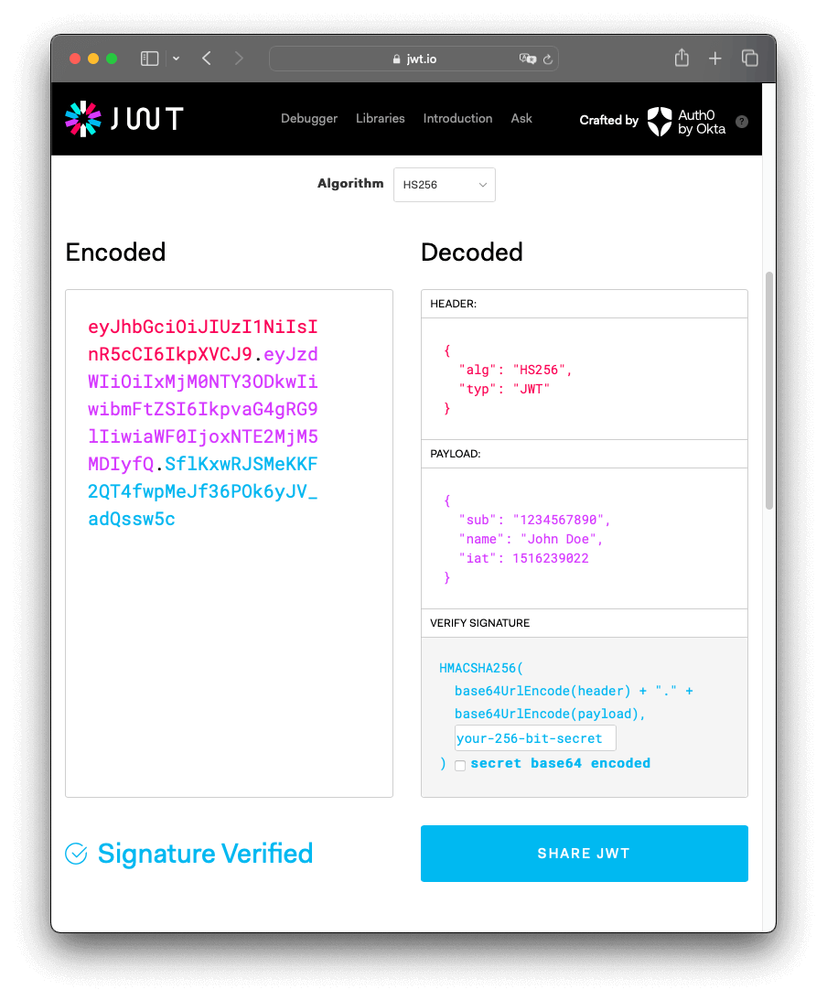

## Json Web Token (JWT)
> ---
> **JWT is an open standard** that defines a way of securely exchange data between *different parts*.
>
>> **"open standard"**: A set of rules or specifications for (doing) something.
>
>> **What different parts?**: Different systems, servers, users, a client and a server etc.
> ---

- Why and when JWT?

    — JWT is a **secure way of exchange information**.

    — **Tokens are not stored in the server**, but in the browser.
    - > This means that the user don't have to authenticate when changing from servers.

    — JWT is used for **authorization**.
    > ___
    > **Authentication vs. Authorization**
    > 
    > **Authentication**: the process of validatig an user.
    >
    > **Authorization**: the process of validatig an users access.
    >
    > For web-development, authentication means to register an user while authorization means to grant the user access to specific features.
    >___

### The Token (or JWT)
> A small piece of encoded data.

- It has **3 different parts**
    > ---
    > **The Header**
    >> ---
    >> **Metadata about the token**
    >> 1. Type of the token
    >> 2. Encoding Algorithm
    >> 3. It is encoded
    >> ---
    > ---

    > ---
    > **The Payloads**
    >> ---
    >> **The actual data**
    >> 1. Contains the *CLAIMS*
    >> 2. It is encoded
    >> ---
    > ---

    > ---
    > **The Signature**
    >> ---
    >> **Used to verify the message wans't changed**
    >> 1. Encoded header
    >> 2. Encoded payload
    >> 3. Secret (a private key)
    >> ---
    > ---

### Claims
> Claims are the actual data inside the payload | There are 3 types:

- **Registered**: Predefined by JWT documentation.

- **Public**: Those are defined at will - but they should user [IANA](https://www.iana.org/assignments/jwt/jwt.xhtml).

- **Private**: Custom claims.